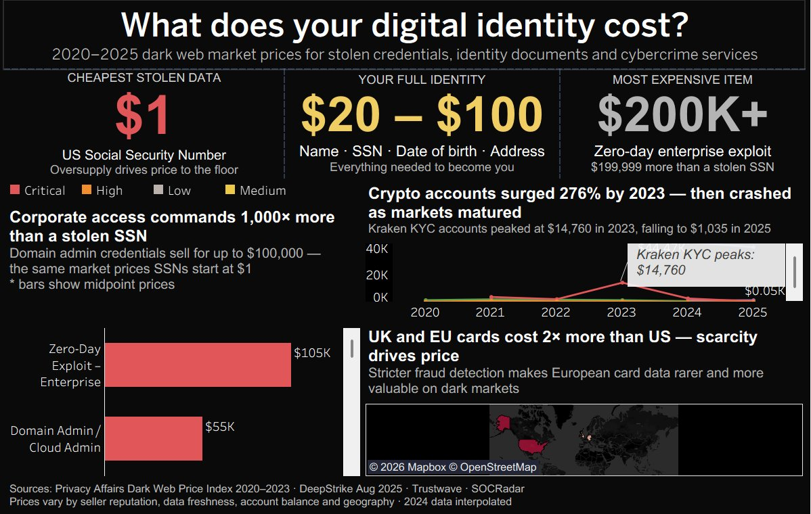

# 🕵️ What Does Your Digital Identity Cost?
### Dark Web Price Index — Interactive Tableau Dashboard (2020–2025)

> *Your Social Security Number sells for $1 on the dark web. A corporate server key sells for $200,000. Same market.*



---

## 📊 Live Dashboard

🔗 **[View on Tableau Public →](https://public.tableau.com/)**
*(Replace with your published link)*

---

## 🧠 Project Overview

This project visualises 5 years of dark web market pricing data (2020–2025), spanning stolen credentials, identity documents, financial accounts, and cybercrime services. The goal is to make abstract cybersecurity risk **tangible and human** — by showing exactly what your data is worth to bad actors.

### Key Insights
- 🔴 A **US Social Security Number** costs as little as **$1** — oversupply has driven price to the floor
- 🟠 Your **complete identity** ("Fullz": name + SSN + DOB + address) sells for **$20–$100**
- ⚪ **Corporate domain admin access** sells for **$10,000–$100,000+** via Initial Access Brokers (IABs)
- 📈 **Crypto account prices surged 276%** by 2023, then crashed as markets matured
- 🌍 **UK and EU credit card data costs 2× more** than US data — scarcity from stricter fraud detection drives price

---

## 🗂️ Repository Structure

```
dark-web-price-index/
│
├── data/
│   ├── Dark_Web_Price_Index_All_Years.csv   ← Main dataset (2020–2025, 73 rows)
│   └── Dark_Web_Price_Index_2025_Full.xlsx  ← Excel version with multiple sheets
│
├── screenshots/
│   └── dashboard_final.png                  ← Final dashboard screenshot
│
├── assets/
│   └── color_palette.md                     ← Dashboard color reference
│
└── README.md
```

---

## 📁 Dataset Documentation

### `Dark_Web_Price_Index_All_Years.csv`

The primary flat-file dataset used as the Tableau data source. Contains **73 rows** across **6 years** (2020–2025).

| Column | Type | Description |
|--------|------|-------------|
| `Year` | Integer | Year of price observation (2020–2025) |
| `Category` | String | Product category (e.g. "Credit Card Data", "Corporate Access") |
| `Product` | String | Specific item name (e.g. "Social Security Number (SSN)") |
| `Country` | String | Country of origin / target market |
| `Organization` | String | Platform or institution associated with the data |
| `Price_Low_USD` | Number | Lowest observed listing price in USD |
| `Price_High_USD` | Number | Highest observed listing price in USD |
| `Price_Mid_USD` | Number | Midpoint price — `(Low + High) / 2` — used in charts |
| `Price_Note` | String | "Actual" or "Estimated – linear interpolation 2023→2025" |
| `Source` | String | Primary source for the data point |
| `Is_Estimated` | Boolean | `Yes` if 2024 interpolated estimate, `No` if sourced from published index |

### Categories covered
| Category | Example Products |
|----------|-----------------|
| Identity – PII | SSN, Fullz, Driver's License, Medical Records |
| Credit Card Data | Standard CC, High-Limit CC (regional variants) |
| Financial Accounts | Bank logins (low/high balance), PayPal |
| Crypto Accounts | Coinbase, Kraken, Binance (KYC verified) |
| Hacked Services | Gmail, Facebook accounts |
| Cybercrime Services | DDoS attacks, Infostealer subscriptions, RaaS |
| Corporate Access | VPN logins, Local Admin, Domain Admin, Zero-days |
| Forged Documents – Physical | Passports (Malta, France) |
| DDoS Attacks | 24hr unprotected site attacks |
| Email Database Dumps | Per-million-record dumps |

### ⚠️ Data Integrity Notes

- **2020–2023 data** — sourced directly from Privacy Affairs Dark Web Price Index (published annually). Treated as **actuals**.
- **2025 data** — sourced from DeepStrike (August 2025 snapshot), Trustwave, and SOCRadar. Treated as **actuals**.
- **2024 data** — **no public price index was published for 2024**. Values are **linear interpolations** between 2023 actuals and August 2025 actuals: `2024 value = (2023 + 2025) / 2`. All estimated rows are flagged with `Is_Estimated = Yes` and labeled in `Price_Note`. Do not present 2024 values as primary research.
- Prices vary significantly by seller reputation, data freshness, account balance, and geography. All values represent observed market listings, not guaranteed transaction prices.

---

## 🎨 Dashboard Design

### Theme
Dark terminal aesthetic (`#0A0A0A` background) to match the subject matter — designed to feel like a real dark market interface rather than a corporate dashboard.

### Color Palette

| Use | Hex | Description |
|-----|-----|-------------|
| Critical threat | `#C0392B` | High-value corporate / identity items |
| High threat | `#E67E22` | Financial accounts |
| Medium threat | `#F1C40F` | Mid-tier items |
| Low threat | `#95A5A6` | Commodity data (SSNs, email dumps) |
| Background | `#0A0A0A` | Dashboard and sheet background |
| Text primary | `#FFFFFF` | Headlines and labels |
| Text secondary | `#888888` | Subtitles and annotations |
| Text tertiary | `#555555` | Footer and metadata |

### Layout (1200 × 800px fixed)
```
┌─────────────────────────────────────────────────────────┐
│  TITLE: What does your digital identity cost?           │
│  Subtitle: 2020–2025 dark web market prices...          │
├───────────────┬───────────────┬─────────────────────────┤
│   $1          │  $20 – $100   │        $200K+            │
│  Cheapest     │  Full Identity│    Most Expensive        │
├───────────────┴───────────────┴─────────────────────────┤
│  Risk Level: ■ Critical  ■ High  ■ Medium  ■ Low        │
├──────────────────────────┬──────────────────────────────┤
│  BAR CHART HEADLINE      │  LINE CHART HEADLINE         │
│                          │                              │
│  Receipt Bar Chart       │  YoY Line Chart (2020–2025)  │
│  (Products × Price_Mid)  │                              │
│                          ├──────────────────────────────┤
│                          │  MAP HEADLINE                │
│                          │  Country Map                 │
│                          │  (Credit card prices)        │
├──────────────────────────┴──────────────────────────────┤
│  Sources: Privacy Affairs · DeepStrike · Trustwave...   │
└─────────────────────────────────────────────────────────┘
```

### Calculated Fields (Tableau)

**Price Display** — clean label format, no cents:
```
IF [Price_Mid_USD] >= 10000
THEN "$" + STR(ROUND([Price_Mid_USD]/1000, 0)) + "K"
ELSEIF [Price_Mid_USD] >= 1000
THEN "$" + STR(ROUND([Price_Mid_USD]/1000, 1)) + "K"
ELSE "$" + STR(INT([Price_Mid_USD]))
END
```

**Threat Level** — drives color encoding:
```
IF [Price_Mid_USD] >= 10000 THEN "Critical"
ELSEIF [Price_Mid_USD] >= 500 THEN "High"
ELSEIF [Price_Mid_USD] >= 50 THEN "Medium"
ELSE "Low"
END
```

**Category Group** — collapses to 5 display categories:
```
IF [Category] = "Identity – PII" THEN "Identity"
ELSEIF [Category] = "Credit Card Data" THEN "Financial"
ELSEIF [Category] = "Financial Accounts" THEN "Financial"
ELSEIF [Category] = "Crypto Accounts" THEN "Financial"
ELSEIF [Category] = "Corporate Access" THEN "Corporate"
ELSEIF [Category] = "Cybercrime Services" THEN "Cybercrime"
ELSEIF [Category] = "Forged Documents – Physical" THEN "Forged Docs"
ELSE "Other"
END
```

**Is 2025** — boolean flag for filtering:
```
[Year] = 2025
```

---

## 🔧 How to Reproduce

### Prerequisites
- Tableau Public (free) or Tableau Desktop
- The CSV file from `/data/`

### Steps

1. **Clone or download** this repository
2. **Open Tableau Public** → Connect to a File → Text File → select `Dark_Web_Price_Index_All_Years.csv`
3. In the Data Source tab, verify:
   - `Year` is set to **Number (Whole)**, not Date
   - `Price_Mid_USD`, `Price_Low_USD`, `Price_High_USD` are **Number (Decimal)**
   - `Is_Estimated` is **String**
4. **Create the 4 calculated fields** listed above (Analysis → Create Calculated Field)
5. **Build sheets** in this order:
   - Sheet 1: Horizontal bar chart — Product on Rows, AVG(Price_Mid_USD) on Columns, colored by Threat Level, filtered to Year = 2025
   - Sheet 2: Line chart — Year on Columns, AVG(Price_Mid_USD) on Rows, Category on Color, filtered to exclude "Forged Documents – Physical"
   - Sheet 3: Choropleth map — Country on Detail, AVG(Price_Mid_USD) on Color, filtered to Category = "Credit Card Data" and Year = 2025
6. **Create the dashboard** at 1200 × 800px fixed size, dark background (#0A0A0A)
7. **Add text objects** for title, KPIs, chart headlines, and footer
8. **Publish** to Tableau Public → right-click data source → Extract Data first

---

## 📚 Sources

| Source | Coverage | Link |
|--------|----------|------|
| Privacy Affairs Dark Web Price Index | 2020–2023 actuals | [privacyaffairs.com](https://privacyaffairs.com/dark-web-price-index/) |
| DeepStrike Dark Web Pricing 2025 | August 2025 snapshot | [deepstrike.io](https://deepstrike.io/blog/dark-web-data-pricing-2025) |
| Trustwave SpiderLabs | 2025 methodology | [trustwave.com](https://www.trustwave.com/) |
| SOCRadar | 2025 supporting data | [socradar.io](https://socradar.io/) |
| Verizon DBIR 2025 | Industry context | [verizon.com](https://www.verizon.com/business/resources/reports/dbir/) |
| IBM X-Force 2025 | Infostealer trend data | [ibm.com](https://www.ibm.com/reports/threat-intelligence) |

---

## ⚖️ Disclaimer

This project is for **educational and awareness purposes only**. All data is sourced from publicly available cybersecurity research reports. No dark web data was collected directly. The goal is to help people understand the real-world value of their personal data and the scale of the cybercrime economy — not to facilitate any illegal activity.

---

## 👤 Author

**Devashree Buch**
Data Visualisation | Cybersecurity Awareness

*Built with Tableau Public · Data sourced from Privacy Affairs & DeepStrike*

---

## ⭐ If you found this useful

- Star this repository
- Share the [live dashboard](https://public.tableau.com/) on LinkedIn or Twitter
- Tag **#TableauPublic #DataViz #Cybersecurity #VizOfTheDay**
